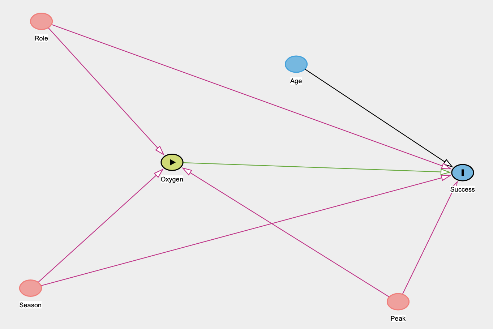
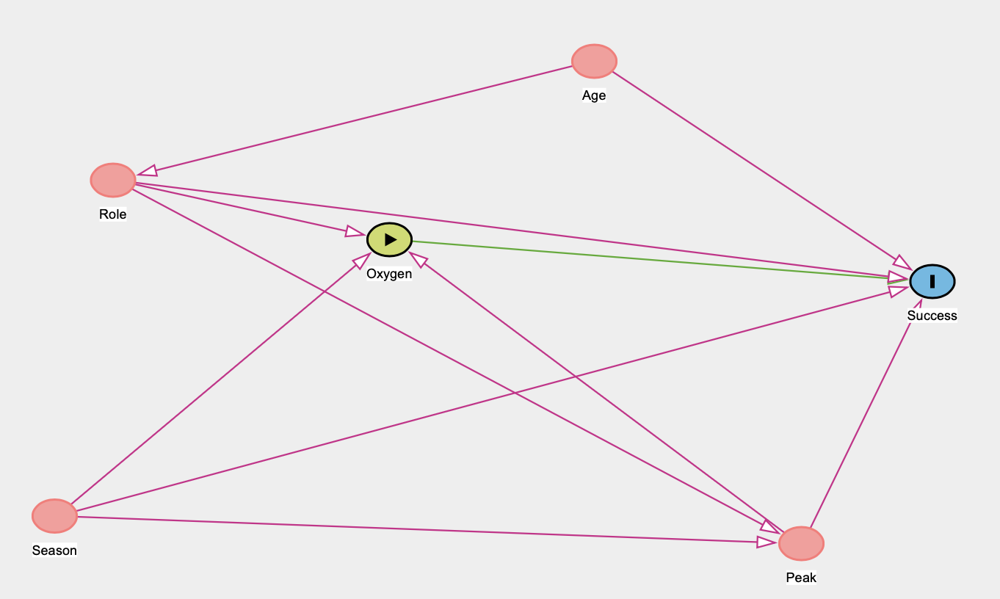

```{r setup, include=FALSE}
knitr::opts_chunk$set(echo = TRUE)
```

# Motivation

On May 29, 1953, New Zealand’s Ed Hillary and Darjeeling’s Sherpa Tenzing Norgay became the first known humans to reach the summit of Mount Everest - the highest point on this Earth [@everest]. Mount Everest is located on the border of Tibet and Nepal and is part of the Himalayan Mountains, which span roughly 1,500 miles and cover parts of India, Pakistan, Afghanistan, China, Bhutan and Nepal [@fultonk_2021]. 

Climbing these mountains is risky and dangerous. For Mount Everest, the most heavily studied of the peaks, the death rate has remained steady at roughly 1%, though over the past three decades there is evidence from a study by the University of Washington that the success rate of summiting has doubled. Why is this? The researchers note a number of potential reasons, including better weather forecasts, elevated flow rates of supplemental oxygen, fixed lines, and experience of leaders [@ma_2020].  

I am wondering what the true effect of using oxygen on reaching the summit of the Himalayan peaks is. Does it make a difference? I will use techniques I learned in my Causal Inference class at Macalester to find out. 

# Data

```{r, message=FALSE, warning=FALSE}
library(tidyverse)
library(foreign)
library(broom)
library(survey)

members <- read.dbf("HIMDATA/members.DBF")
```


The data for this analysis comes from [The Himalayan Database](https://www.himalayandatabase.com), which is compilation of records for all expeditions that have climbed in the Nepal Himalaya [@hdata]. The data cover expeditions to the most significant mountaineering peaks in Nepal dating back to 1905. To do so, the database relies on the expedition archives of Elizabeth Hawley, a longtime journalist based in Kathmandu, and information gathered from books, alpine journals and correspondence with Himalayan climbers.

More specifically, I will be using the `members` dataset, which provides information about each person ascending the Himalayas including an expedition id, the year of the expedition and peak they are traveling to, season, sex, age, citizenship, status (whether they are a climber/leader/doctor, etc), whether they were injured or died, if they used oxygen, and much more. Given this dataset contains 81,985 member expeditions and 398 peaks, I will only be looking at the seven most traveled peaks. These are Mount Everest, Ama Dablam, Cho Oyu, Manaslu, Dhaulagiri I, Lhotse, and Makalu. Mount Everest is by far the most traversed of these seven, with 23,402 attempts recorded, followed by Ama Dablam with 9,548. I will also only look at the three most common roles (climber, H-A worker, and leader) given that certain roles such as "base camp manager" aren't going to be ascending the peaks. 

```{r, warning=FALSE, message=FALSE}
# number of peaks
members %>%
  count(PEAKID) %>%
  nrow()

members <- members %>%
  filter(PEAKID %in% c("EVER", "AMAD", "CHOY", "MANA", "DHA1", "LHOT", "MAKA")) %>%
  filter(STATUS %in% c("Climber", "H-A Worker", "Leader"))
```

This leaves us with a combined 50,568 expeditions across seven peaks.

# Creating a Causal Graph

To understand variables that might be confounding the relationship between oxygen use and summit success rate, we need some background knowledge about Himalayan ascents. I am by no means an expert on this topic, so it will be exploratory data analysis to the rescue (yay)!

But first, let's see the overarching success rate with and without oxygen. It appears that less than 40% of hikers use oxygen, but those that do have a much higher success rate than those that do not.

```{r}
members %>%
  count(MO2USED, MSUCCESS) %>%
  ggplot(aes(x=MO2USED, y = n, fill = MSUCCESS))+
  geom_col()+
  labs(x = "Oxygen used?", fill = "Success?", y = "Member expeditions", title = "Expedition success by oxygen use")+
  scale_y_continuous(labels = scales::comma)+
  scale_fill_manual(values = c("lightcoral", "darkolivegreen3"))
```

## Exploring variables that can impact treatment and outcome

Next, what variables could impact both ascent success and whether or not someone uses oxygen? There are a few that come to mind: the hiker's age, their sex, what season they climb in, what peak they are climbing to, and their role.

Let's first see if oxygen use and success varies with age. It appears that the average age for those that do not successfully ascend their peak is slightly higher than those that do, but not by too much. The relationship between oxygen use and age is very weak. We can consider a link between age and success in our causal diagram, but will not include one between age and oxygen. 

```{r, fig.show="hold", out.width='45%'}
members %>%
  ggplot(aes(x=CALCAGE, fill = MSUCCESS))+
  geom_density(alpha = 0.5)+
  scale_fill_manual(values = c("lightcoral", "darkolivegreen3"))+
  labs(x="Hiker age", fill = "Success?")

members %>%
  ggplot(aes(x=CALCAGE, fill = MO2USED))+
  geom_density(alpha = 0.5)+
  scale_fill_manual(values = c("lightcoral", "lightsteelblue2"))+
  labs(x="Hiker age", fill = "Oxygen used?")
```

Next, let's look at sex. It seems like males have a success rate about 3.2% higher than females but that the two sexes use oxygen at almost the exact same rate. 3.2% isn't a very large difference, and for this reason I do not think sex is necessary to include in our causal diagram.  

```{r}
#Remove 1 person with sex of X
members <- members %>%
  filter(SEX != "X")

members %>%
  count(SEX, MSUCCESS) %>%
  pivot_wider(names_from = MSUCCESS, values_from = n) %>%
  rename("Success" = "TRUE", 
         "Failure" = "FALSE") %>%
  mutate(PropSuccess = Success/(Success+Failure))

members %>%
  count(SEX, MO2USED) %>%
  pivot_wider(names_from = MO2USED, values_from = n) %>%
  rename("Oxygen" = "TRUE", 
         "No oxygen" = "FALSE") %>%
  mutate(`Prop using oxygen` = `Oxygen`/(Oxygen+`No oxygen`))
```

The third variable we will look into is peak. From the graphs below, we see that the rate at which hikers use oxygen definitely differs by the peak they are climbing as does their success. Peak will be a very important variable for our causal graph. 

```{r, fig.show="hold", out.width='45%'}
members %>%
  count(PEAKID, MO2USED) %>%
  pivot_wider(names_from = MO2USED, values_from = n) %>%
  rename("Oxygen" = "TRUE", 
         "No oxygen" = "FALSE") %>%
  mutate(`Prop using oxygen` = `Oxygen`/(Oxygen+`No oxygen`)) %>%
  ggplot(aes(x=reorder(PEAKID, -`Prop using oxygen`), y=`Prop using oxygen`))+
  geom_col(fill = "lightsteelblue2")+
  labs(x = "Peak", y = "Proportion of hikers using oxygen")

members %>%
  count(PEAKID, MSUCCESS) %>%
  pivot_wider(names_from = MSUCCESS, values_from = n) %>%
  mutate(`PropSuccess` = `TRUE`/(`TRUE`+`FALSE`)) %>%
  ggplot(aes(x=reorder(PEAKID, -PropSuccess), y=PropSuccess))+
  geom_col(fill = "darkolivegreen3")+
  labs(x = "Peak", y = "Proportion of hikers summiting")
```

Fourth, we will look the role the hiker has in the expedition. About 61% are climbers while 26% are H-A workers and 13% are leaders. It is clear that H-A workers use oxygen at a much higher rate than climbers and leaders. Additionally, their success rate is significantly higher. This will be another key variable for the causal graph. 

```{r, fig.show="hold", out.width='45%'}
members %>%
  count(STATUS, MO2USED) %>%
  pivot_wider(names_from = MO2USED, values_from = n) %>%
  rename("Oxygen" = "TRUE", 
         "No oxygen" = "FALSE") %>%
  mutate(`Prop using oxygen` = `Oxygen`/(Oxygen+`No oxygen`)) %>%
  ggplot(aes(x=reorder(STATUS, -`Prop using oxygen`), y=`Prop using oxygen`))+
  geom_col(fill = "lightsteelblue2")+
  labs(x = "Role", y = "Proportion using oxygen")

members %>%
  count(STATUS, MSUCCESS) %>%
  pivot_wider(names_from = MSUCCESS, values_from = n) %>%
  mutate(`PropSuccess` = `TRUE`/(`TRUE`+`FALSE`)) %>%
  ggplot(aes(x=reorder(STATUS, -PropSuccess), y=PropSuccess))+
  geom_col(fill = "darkolivegreen3")+
  labs(x = "Role", y = "Proportion of hikers summiting")
```

Lastly, we can look at the season the climb took place in. 97.3% of climbs occur in the spring and fall given the harsh conditions of the summer and winters. Due to this extreme, we will remove the 1358 climbs attempted during the winter and summer. Success rate is fairly similar in the fall and spring, with the spring have a success rate about 4.2% higher than the fall. However, oxygen is used at a significantly higher rate in the spring than the fall.

```{r}
members <- members %>%
  filter(MSEASON %in% c(1, 3)) %>%
  mutate(MSEASON = case_when(MSEASON == 1 ~ "Spring", 
                            TRUE ~ "Fall"))

members %>%
  count(MSEASON, MSUCCESS) %>%
  pivot_wider(names_from = MSUCCESS, values_from = n) %>%
  rename("Success" = "TRUE", 
         "Failure" = "FALSE") %>%
  mutate(PropSuccess = Success/(Success+Failure))

members %>%
  count(MSEASON, MO2USED) %>%
  pivot_wider(names_from = MO2USED, values_from = n) %>%
  rename("Oxygen" = "TRUE", 
         "No oxygen" = "FALSE") %>%
  mutate(`Prop using oxygen` = `Oxygen`/(Oxygen+`No oxygen`))
```

## Constructing the initial causal diagram

With the relationships we know we can construct the initial causal diagram shown below. 

{width='50%'}

### Exploring additional relationships between variables

The prior causal diagram isn't complete because we haven't fully explored all relationships between variables. Do certain roles tend to vary with age? Are certain peaks hiked more often in a particular season? We can do more EDA to answer these questions. 

First, we can see that leaders are on average the oldest of the three roles while H-A workers the youngest. We should include a link between age and role in the causal diagram.  

```{r}
members %>%
  ggplot(aes(x=CALCAGE, fill = STATUS))+
  geom_density(alpha = 0.5)+
  labs(x = "Hiker age", fill = "Role")+
  scale_fill_manual(values = c("khaki", "thistle1", "lightblue"))
```


Second, we can see that certain peaks are climbed more often in one season versus another. For example, over 80% of Ama Dablam expeditions are completed in the fall but over 80% of expeditions to Mount Everest are done in the spring. We should include a link between season and peak. 

```{r}
members %>%
  count(PEAKID, MSEASON) %>%
  pivot_wider(names_from = MSEASON, values_from = n) %>%
  mutate(PropFall = Fall/(Fall + Spring)) %>%
  ggplot(aes(x=reorder(PEAKID, -PropFall), y=PropFall))+
  geom_col(fill = "sienna1")+
  labs(x = "Peak", y = "Proportion of hikes done in Fall")
```

Lastly, we might want to consider a link between role and peak. We can see that certain peaks have a higher proportion of leaders (Lhotse) or H-A workers (Everest) compared to others. 

```{r}
members %>%
  count(STATUS, PEAKID) %>%
  group_by(PEAKID) %>%
  mutate(prop = n/sum(n)) %>%
  ggplot(aes(x=PEAKID, y=prop, fill =STATUS))+
  geom_col()+
  scale_fill_manual(values = c("khaki", "thistle1", "lightblue"))+
  labs(x= "Peak", fill = "Role", y = "Proportion of hikes")
```

This makes our final causal diagram as shown below!

{width='50%'}

# Regression

To understand if oxygen use increases your chances of summiting a Himalayan peak, we will fit a model to predict success with our treatment, oxygen use, as an independent variable. But what other variables should be included in our model? After all, we did just determine that there are confounding variables in the relationship between oxygen and summit success. 

## Identify noncausal paths

To know what variables to include in our regression, we need to identify **noncausal** paths from our exposure to outcome. Noncausal paths are indirect paths linking oxygen to success that do not contain a collider. Thus, there are 6 noncausal paths in this diagram:

$$(1) \quad \text{Oxygen} \leftarrow \text{Season} \rightarrow \text{Success}$$
$$(2) \quad \text{Oxygen} \leftarrow \text{Season} \rightarrow \text{Peak} \rightarrow \text{Success}$$
$$(3) \quad \text{Oxygen} \leftarrow \text{Peak} \rightarrow \text{Success}$$
$$(4) \quad \text{Oxygen} \leftarrow \text{Role} \rightarrow \text{Success}$$
$$(5) \quad \text{Oxygen} \leftarrow \text{Role} \rightarrow \text{Peak} \rightarrow \text{Success}$$
$$(6) \quad \text{Oxygen} \leftarrow \text{Role} \leftarrow \text{Age} \rightarrow \text{Success}$$

These paths contain no colliders, only forks and chains. We can block each of these paths by conditioning on a particular variable. All variables that are conditioned on are included in our outcome regression models. We can condition on `Season` to block paths 1 & 2, `Peak` to block paths 3 & 5, and `Role` to block paths 4 & 6. While `Age` is included in our causal diagram and in noncausal path (6), we can block this path with `Role` and not have to include `Age` in our model. 

## The Outcome Regression

From our noncausal paths, we learned that we can get **exchangeability** of the summiting potential outcomes across treatment (oxygen use) groups conditional on `Role`, `Season`, and `Peak`. This means we can look within subsets of the data defined by `Role`, `Season` and `Peak` and fairly compare the average outcome (probability of summiting) between the treatment groups.

In other words,
$$Y^a   \perp\!\!\!\perp A \Big| \text{ Role, Season, Peak} \quad \text{where } Y = \text{Success, } A = \text{Oxygen}$$

Because the outcome (success) is binary, we can fit a logistic regression model to simultaneously quantify the relationship between treatment and outcome while conditioning on Role ($R$), Season ($S$), and Peak ($P$). 

$$\text{log}\left(\frac{E[Y|A, R, P, S}{1-E[Y|A, P, R, S]}\right) = \beta_0 + \beta_1A+\beta_2P + \beta_3R + \beta_4S$$

A more intervention-oriented interpretation of the treatment can be achieved by rewriting the above equation as follows:

$$\text{log}\left(\frac{E[Y^a|P, R, S]}{1-E[Y^a|P, R, S]}\right) = \beta_0 + \beta_1a+\beta_2P + \beta_3R + \beta_4S$$

This allows us to interpret the $\beta_1a$ coefficient as the change in log odds of summiting comparing all study units using oxygen ($Y_1$) versus all study units not using oxygen ($Y_0$), for fixed role, season, and peak. 

Now, we can fit the model. Since it seems that certain peaks are climbed significantly more often in spring than fall and vice-versa, it will be worthwhile to consider an interaction between season and peak. 

```{r}
mod_overall <- glm(as.factor(MSUCCESS) ~  MSEASON*PEAKID +STATUS + MO2USED, data = members, family = "binomial")

summary(mod_overall)
```

What we are interested from this output is the `MO2USED` coefficient, which is the only coefficient with a causal interpretation. This is called the **Table 2 fallacy**: non-treatment coefficients cannot be interpreted causally. If we were interested in causal effects in subgroups, we could include an interaction between the treatment and a particular variable. 

```{r}
broom::tidy(mod_overall) %>%
    filter(str_detect(term, "MO2USED")) %>%
    mutate(
        odds_ratio = exp(estimate),
        ci_lower = exp(estimate - qnorm(0.975)*std.error),
        ci_upper = exp(estimate + qnorm(0.975)*std.error)
)
```

From our treatment coefficient, we learn that if all hikers used oxygen, the odds of summiting would be multiplied by 23.4 as compared to all hikers not using oxygen. Wow... that's quite a lot! It appears oxygen is very useful in ascending the Himalayan Mountains.

# Inverse Probability Weighting (IPW)

With regression, we stopped noncausal associations by conditioning on `Role`, `Season`, and `Peak`. Another way to stop these noncausal associations is by removing arrows so that noncausal paths no longer exist. This is called **inverse probability weighting**. IPW effectively simulates interventions by re-proportioning outcomes.

$$\text{Weights} = \frac{1}{P(A=a|Z)} \quad \text{where } Z = \{\text{Season, Role, Peak}\}$$

We can start the IPW process by creating a **propensity score model**. This will create weights and help us achieve balance in our covariates.

```{r}
ps_mod <- glm(MO2USED ~ MSEASON + PEAKID + STATUS, data = members, family = "binomial")

members <- members %>%
    mutate(
        ps = predict(ps_mod, newdata = members, type = "response"),
        ipw = case_when(
            MO2USED==TRUE ~ 1/ps,
            MO2USED==FALSE ~ 1/(1-ps)
        )
    )
```

Comparing our covariates before and after IPW, we can see that the IPW helped bring balance.

```{r, fig.show="hold", out.width='45%'}
ggplot(members, aes(x = STATUS, fill = MO2USED)) +
    geom_bar(position = "fill")+
  labs(title = "Before IPW", x = "Role", y= "Proportion of hikers using oxygen", fill = "Oxygen used?")+
  scale_fill_manual(values = c("lightcoral", "lightsteelblue2"))

ggplot(members, aes(x = STATUS, fill = MO2USED, weight = ipw)) +
  geom_bar(position = "fill")+
    labs(title = "After IPW", x = "Role", y= "Proportion of hikers using oxygen", fill = "Oxygen used?")+
  scale_fill_manual(values = c("lightcoral", "lightsteelblue2"))
```

```{r, fig.show="hold", out.width='45%'}
ggplot(members, aes(x = PEAKID, fill = MO2USED)) +
    geom_bar(position = "fill")+
  labs(title = "Before IPW", x = "Peak", y= "Proportion of hikers using oxygen", fill = "Oxygen used?")+
  scale_fill_manual(values = c("lightcoral", "lightsteelblue2"))

ggplot(members, aes(x = PEAKID, fill = MO2USED, weight = ipw)) +
  geom_bar(position = "fill")+
    labs(title = "After IPW", x = "Peak", y= "Proportion of hikers using oxygen", fill = "Oxygen used?")+
  scale_fill_manual(values = c("lightcoral", "lightsteelblue2"))
```

```{r, fig.show="hold", out.width='45%'}
ggplot(members, aes(x = MSEASON, fill = MO2USED)) +
    geom_bar(position = "fill")+
    labs(title = "Before IPW", x = "Season", y= "Proportion of hikers using oxygen", fill = "Oxygen used?")+
  scale_fill_manual(values = c("lightcoral", "lightsteelblue2"))

ggplot(members, aes(x = MSEASON, fill = MO2USED, weight = ipw)) +
  geom_bar(position = "fill")+
    labs(title = "After IPW", x = "Season", y= "Proportion of hikers using oxygen", fill = "Oxygen used?")+
  scale_fill_manual(values = c("lightcoral", "lightsteelblue2"))
```

Now we can use the IP weights constructed above in a weighted regression model to estimate causal effects.

```{r}
design <- svydesign(ids = ~0, weights = members$ipw, data = members)

# Fit a marginal structural model to estimate overall ACE
overall_fit <- svyglm(
    MSUCCESS ~ MO2USED,
    data = members,
    design = design,
    family = "quasibinomial"
)

broom::tidy(overall_fit) %>%
    filter(str_detect(term, "MO2USED")) %>%
    mutate(
        odds_ratio = exp(estimate),
        ci_lower = exp(estimate - qnorm(0.975)*std.error),
        ci_upper = exp(estimate + qnorm(0.975)*std.error)
    )
```

With IPW,  we learn that if all hikers used oxygen, the odds of summiting would be multiplied by 7.46 as compared to all hikers not using oxygen. This is significantly smaller than with our outcome regression, but still quite significant as the confidence interval spans [5.89, 9.46]. There is pretty strong evidence that oxygen is beneficial when seeking a successful summit.

# A note about sensitivity analyses

A typical final step of causal analysis is conduct a sensitivity analysis. A sensitivity analysis asks how strongly associated must unmeasured variables be with other variables in our graph to qualitatively change results. The most important unmeasured variable in our analysis that I can think of would be hiker health. I would assume hikers in poor health are more likely to use oxygen than hikers in good health and that these hikers in poor health are less likely to successfully summit than hikers in good health. 

If, for some reason, hikers in poor health were *less* likely to use oxygen than hikers in good health in addition to being less likely to summit, this unmeasured variable could be confounding and impact our results. A sensitivity analysis could tell us what the estimated average causal effect of using oxygen on summit success would be for a given confounder-exposure and confounder-outcome relationship. It could also tell us how strong these effects would have to be for the effect of oxygen to be insignificant. 

In reality, because we expect that hikers in poor health are more likely to use oxygen than hikers in good health and that these hikers in poor health are less likely to successfully summit than hikers in good health, a sensitivity analysis not helpful. Including such an unmeasured variable like hiker health in our model would like only increase our estimated odds ratio.

# Conclusions

The results of this analysis provide strong evidence of oxygen use being beneficial for ascending the most popular peaks of the Himalayan Mountains. In the future, I would like to look more into variables such as whether oxygen was used while sleeping and/or climbing, as the general *Oxygen used?* variable I performed this analysis with is fairly general. I also think it would be interesting to understand the causal effects of attempting an ascent with a leader on your team, as the study by the University of Washington seemed to emphasize experience of leaders as a potential reason why summit success has risen over the past few decades. 

# References
