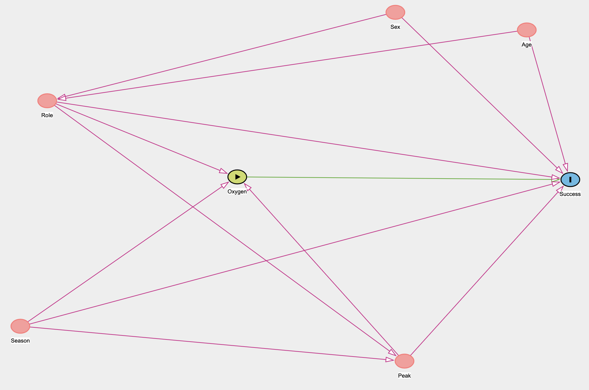

```{r setup, include=FALSE}
knitr::opts_chunk$set(echo = TRUE)
```

```{r}
library(tidyverse)
library(foreign)
library(splines)
library(broom)
library(survey)
library(tipr)

members <- read.dbf("HIMDATA/members.DBF")
members <- members %>%
  filter(PEAKID %in% c("EVER", "AMAD", "CHOY", "MANA", "DHA1", "LHOT", "MAKA")) %>%
  filter(STATUS %in% c("Climber", "H-A Worker", "Leader"))
```

# Final Causal Diagram



Noncausal paths:

Condition on Season or Peak
$$\text{Oxygen} \leftarrow \text{Season} \rightarrow \text{Peak} \rightarrow \text{Success}$$
Condition on Season
$$ \text{Oxygen} \leftarrow \text{Season} \rightarrow \text{Success}$$
Condition on Role or Peak
$$ \text{Oxygen} \leftarrow \text{Role} \rightarrow \text{Peak} \rightarrow \text{Success}$$
Condition on Role
$$ \text{Oxygen} \leftarrow \text{Role} \rightarrow \text{Success}$$

Condition on Role or Sex
$$\text{Oxygen} \leftarrow \text{Role} \leftarrow \text{Sex} \rightarrow \text{Success}$$
Condition on Peak
$$\text{Oxygen} \leftarrow \text{Peak} \rightarrow \text{Success}$$
Condition on Age or Role
$$\text{Oxygen} \leftarrow \text{Role} \leftarrow \text{Age} \rightarrow \text{Success}$$

Conditioning variables: Role, Peak, Season

$$Y^a \perp\!\!\!\perp A \big| \text{ Role}, \text{ Peak}, \text{Season}$$

# Outcome Regression

$$\text{log}\left(\frac{E[Y|A, R, P, S}{1-E[Y|A, P, R, S]}\right) = \beta_0 + \beta_1A+\beta_2P + \beta_3R + \beta_4S$$

$$\text{log}\left(\frac{E[Y^a|P, R, S]}{1-E[Y^a|P, R, S]}\right) = \beta_0 + \beta_1a+\beta_2P + \beta_3R + \beta_4S$$

The rewritten line motivates a more intervention-oriented interpretation of the treatment coefficient. 

$\beta_1a$ ACE estimate: change in log odds of success comparing: 

- **All study units use** oxygen versus $(Y_1)$. 
- **All study units do not use** oxygen $(Y_0)$.  

for fixed role, years of season, and peak.  

If $\beta_1 = 0.1, e^{\beta_1} = 1.105$. If all people used oxygen, the odds of success would be multiplied by 1.105 as compared to all people not using oxygen.

Look for interactions: Success definitely varies by Peak but also certain seasons are better for particular peaks, so an interaction between peak and season might be useful.  

```{r}
ggplot(members %>% filter(MSEASON %in% c("1", "3")), aes(x = factor(PEAKID), fill = factor(MSUCCESS))) +
    geom_bar(position = "fill") +
    facet_grid(~factor(MSEASON))

ggplot(members, aes(x = factor(PEAKID), fill = factor(MSUCCESS))) +
    geom_bar(position = "fill") +
    facet_grid(~factor(SEX))

ggplot(members, aes(x = factor(PEAKID), fill = factor(MSUCCESS))) +
    geom_bar(position = "fill") +
    facet_grid(~factor(STATUS))
```

Looking for nonlinearity in quantitative variable: CALCAGE

```{r}
members %>% 
  mutate(MSUCCESS = as.numeric(MSUCCESS)) %>%
  ggplot(aes(x=CALCAGE, y=MSUCCESS))+
  geom_point()+
  geom_smooth(se=FALSE, color = "blue")+
  geom_smooth(formula = y ~ x, method = "glm",
        method.args = list(family="binomial"),
se = FALSE, color = "red")

members %>% 
  mutate(MSUCCESS = as.numeric(MSUCCESS)) %>%
  ggplot(aes(x=CALCAGE, y=MSUCCESS))+
  geom_point()+
  geom_smooth(se=FALSE, color = "blue")+
  geom_smooth(formula = y ~ ns(x,3), method = "glm",
        method.args = list(family="binomial"),
se = FALSE, color = "red")
```

```{r}
members_mod_data <- members %>%
  mutate(MSUCCESS = as.factor(MSUCCESS), MSEASON = as.factor(MSEASON), MO2USED = as.factor(MO2USED)) %>%
  filter(SEX != "X", MSEASON != "2", MSEASON != "4")

mod_overall <- glm(as.factor(MSUCCESS) ~  MSEASON*PEAKID +STATUS + MO2USED, data = members_mod_data, family = "binomial")

summary(mod_overall)
```

```{r}
broom::tidy(mod_overall) %>%
    filter(str_detect(term, "MO2USED")) %>%
    mutate(
        odds_ratio = exp(estimate),
        ci_lower = exp(estimate - qnorm(0.975)*std.error),
        ci_upper = exp(estimate + qnorm(0.975)*std.error)
)
```

Overall, there seems to be a positive effect of using oxygen on successfully ascending a Himalayan Peak: if all hikers used oxygen, their odds of success at 26.37 times higher than if they did not use oxygen.


# IPW

```{r}
ggplot(members, aes(x = factor(PEAKID), fill = factor(MO2USED))) +
    geom_bar(position = "fill")

ggplot(members, aes(x=factor(MSEASON), fill = factor(MO2USED)))+
         geom_bar(position = "fill")

ggplot(members, aes(x=factor(STATUS), fill = factor(MO2USED)))+
         geom_bar(position = "fill")
```

```{r}
ps_mod <- glm(MO2USED ~ MSEASON + PEAKID + STATUS, data = members_mod_data, family = "binomial")
members_mod_data <- members_mod_data %>%
    mutate(
        ps = predict(ps_mod, newdata = members_mod_data, type = "response"),
        ipw = case_when(
            MO2USED==TRUE ~ 1/ps,
            MO2USED==FALSE ~ 1/(1-ps)
        )
    )
```

```{r}
ggplot(members_mod_data, aes(x = STATUS, fill = MO2USED)) +
    geom_bar(position = "fill")
ggplot(members_mod_data, aes(x = STATUS, fill = MO2USED, weight = ipw)) +
  geom_bar(position = "fill")

ggplot(members_mod_data, aes(x = PEAKID, fill = MO2USED)) +
    geom_bar(position = "fill")
ggplot(members_mod_data, aes(x = PEAKID, fill = MO2USED, weight = ipw)) +
  geom_bar(position = "fill")

ggplot(members_mod_data, aes(x = MSEASON, fill = MO2USED)) +
    geom_bar(position = "fill")
ggplot(members_mod_data, aes(x = MSEASON, fill = MO2USED, weight = ipw)) +
  geom_bar(position = "fill")
```

The balance in covariates is better after weighting generally, but less so for MSEASON (possibly because there aren't many winter observations). 

```{r}
# Remove cases with missing weights --> none

# Set up information about weights
design <- svydesign(ids = ~0, weights = members_mod_data$ipw, data = members_mod_data)

# Fit a marginal structural model to estimate overall ACE
overall_fit <- svyglm(
    MSUCCESS ~ MO2USED,
    data = members_mod_data,
    design = design,
    family = "quasibinomial"
)

broom::tidy(overall_fit) %>%
    filter(str_detect(term, "MO2USED")) %>%
    mutate(
        odds_ratio = exp(estimate),
        ci_lower = exp(estimate - qnorm(0.975)*std.error),
        ci_upper = exp(estimate + qnorm(0.975)*std.error)
    )
```

# Sensitivity 

```{r}
# Below we set up a grid of 25 combinations of exposure_confounder_effect and confounder_outcome_effect using rep()
sens_results <- adjust_or_with_continuous(
    effect_observed = 26.36659,
    exposure_confounder_effect = rep(-seq(0.5, by = 0.5, length.out = 5), times = 5),
    confounder_outcome_effect = rep(seq(0.2, 0.9, length.out = 5), each = 5),
    verbose = FALSE,
    or_correction = TRUE
)

# The parameter combinations in the above analysis
data.frame(
    exposure_confounder_effect = rep(-seq(0.5, by = 0.5, length.out = 5), times = 5),
    confounder_outcome_effect = rep(seq(0.2, 0.9, length.out = 5), each = 5)
)
```

```{r}
ggplot(sens_results,aes(x = confounder_outcome_effect, y = rr_adjusted, color = factor(exposure_confounder_effect))) +
    geom_hline(yintercept = sens_results$rr_observed[1], lty = 2) +
    geom_hline(yintercept = 1, lwd = 2, color = "red") +
    geom_point() +
    geom_line() +
    labs(x = "Unmeasured confounder - outcome effect (OR)", y = "Adjusted OR") +
    guides(color = guide_legend(title = "Treatment-confounder relationship\n(mean difference)"))
```

Confounder outcome effect (x axis): represents an odds ratio per unit increase in the confounder–that is, it represents the multiplicative change in odds of success for every additional X that an external reviewer expects.

Treatment confounder relationship: If treatment group units have lower cholesterol* and cholesterol decreases success chances, the positive causal effect of oxygen could be due to the decreased cholesterol experienced by the treatment group.


